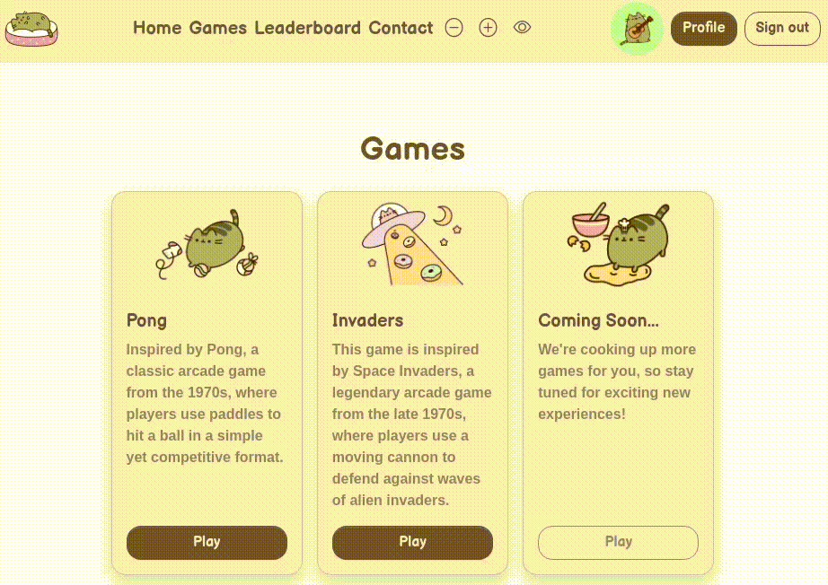
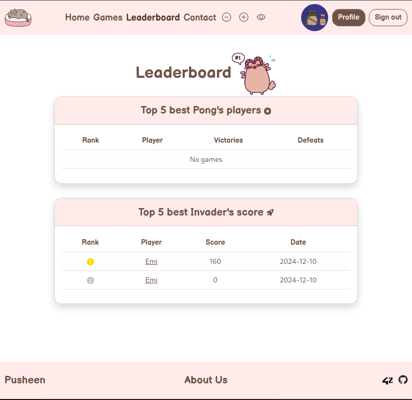
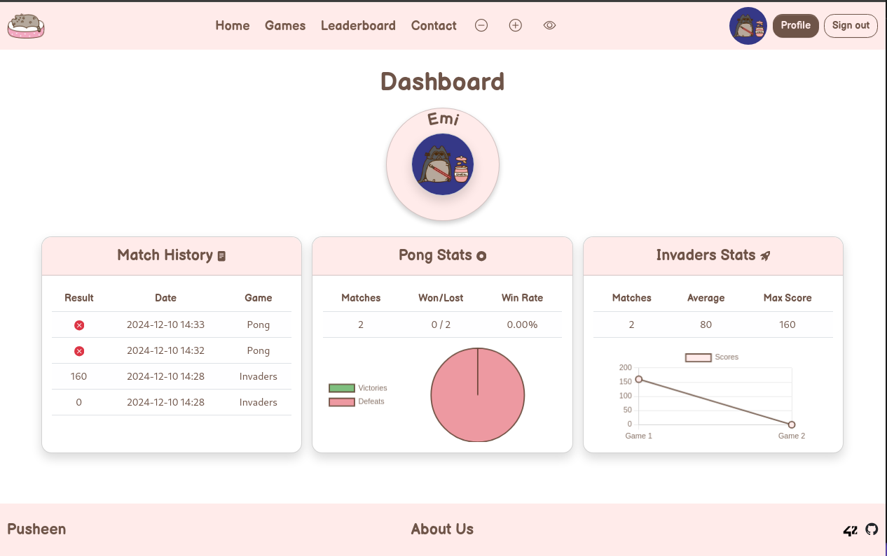
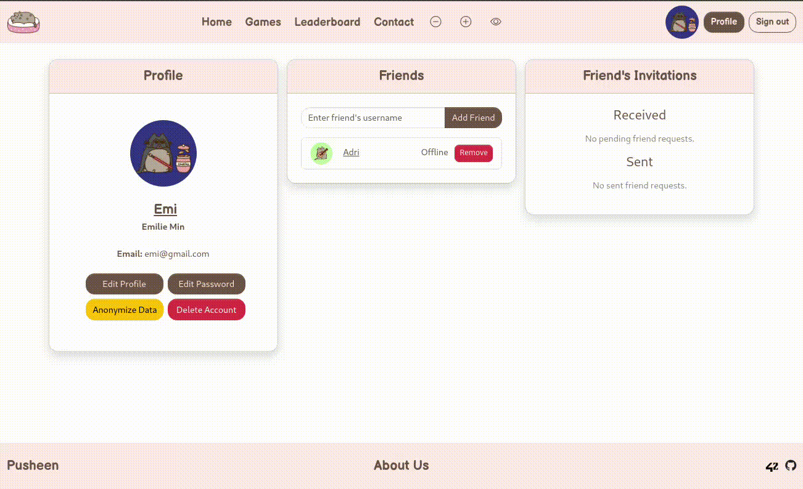

# **TRANSCENDENCE 🏓 : Challenge your skills, compete with friends, and relive the classic fun of Pong – the game that never gets old!**


This project involves developing a web-based platform for real-time Pong gameplay with a user-friendly interface. Using Django for the backend, PostgreSQL for the database, and Bootstrap with JavaScript for the frontend, the application must be a single-page application compatible with Google Chrome.

Core features include live matches between players (with tournament capabilities), a registration system to record player aliases, and automated matchmaking. Authentication will be implemented natively with a signup system and via the 42 API. Security is a priority: passwords must be hashed, inputs validated, and all communications secured via HTTPS. The project should be deployable with Docker in rootless mode. The graphics must capture the essence of the classic Pong (1972), without relying on prebuilt comprehensive solutions.

***NB** : an env file is necessary to matchs Django's, PostgreSQL's and 42 API's settings !*


### **Tech Stack Used** ⚙️

- **Frontend**: JavaScript, Bootstrap, HTML 💻  
- **Backend**: Django, Django REST API, Python (for 42 integration) ⚙️  
- **Database**: PostgreSQL 🌐  
- **Graphics**: ThreeJS/WebGL 🖥️  
- **Real-time Communication**: WebSockets with Daphne & Redis 🔄

## **AUTHENTIFICATION** 👤🔐


The User Management module focuses on user interactions and secure access control within the Pong platform. Users can **register securely** and select a unique display name, update their information, and upload an avatar (with a default option if none is provided). 

Additional features include **friend management** with online status, user profiles **displaying stats** (e.g., wins/losses), and a detailed match history of 1v1 games, accessible to logged-in users. Duplicate usernames/emails must be handled logically. The module also integrates **OAuth 2.0 authentication via the 42 API**, ensuring secure sign-in and seamless token-based exchanges while adhering to best practices for user-friendly and secure login flows.

Additionally, custom work has been done on **Django models** to efficiently manage and store user data in the database, ensuring smooth integration with the backend.

## **GAMEPLAY EXPERIENCE** 🎮



The Gameplay and User Experience module enhances the platform with two games: **Pong** and **Invaders**, both featuring engaging gameplay tailored to user preferences. Remote gameplay supports two players on separate devices with robust handling of network issues, while multiplayer functionality enables matches with 3+ players, such as a 4-player mode on a square board.

**Pusheen's Invaders** 👾 incorporates Pusheen the Cat-themed customization, including unique power-ups, maps, and attacks, alongside a default gameplay mode for simplicity. For both games, **Pusheen's Pong** 🏓 and **Pusheen's Invaders** 👾, dashboards provide comprehensive user and game statistics, featuring detailed match histories, performance metrics, and visually appealing data visualizations like charts and graphs.


A user-friendly interface allows players to track their gaming history and analyze performance conveniently, ensuring an enjoyable and informative experience.





The Graphics module revolutionizes the visual elements of the Pong game by incorporating advanced 3D techniques using **ThreeJS/WebGL** 🌐. This enhances the gameplay experience with stunning visual effects and immersive environments. By leveraging modern 3D technology, the game ensures compatibility, optimal performance, and an aesthetically advanced gaming environment that delights players.


## **RGPD** 🧙‍♂️ 

The **GDPR Compliance** module ensures user privacy and data protection by implementing key features aligned with the regulation. We have introduced **semi-anonymization**, where sensitive user data (e.g., names, display names, avatars) is replaced with random strings in the database upon anonymization requests.

A clear **Privacy Policy** page is provided, and users cannot sign up without accepting the policy. Account deletion includes a confirmation process, permanently **removing all associated data**. These measures empower users to manage their personal information, aligning with GDPR principles while maintaining transparency and control over their data.

Users must adhere to strict password **entropy rules**, ensuring their passwords are sufficiently complex, including a min lentgh of a mix of uppercase, lowercase, numbers, and special characters, to enhance security and prevent unauthorized access.


## **ACCESSIBILITY** ♿️


The Accessibility module ensures our web application is inclusive and user-friendly across various devices, browsers, and user needs. The website is **fully responsive**, adapting to different screen sizes and input methods, providing a consistent experience on desktops, laptops, tablets, and smartphones. Browser support is expanded to include additional browsers, ensuring compatibility and a seamless experience for more users.

Accessibility for **visually impaired users** is enhanced with features like screen reader support, descriptive alt text, high-contrast color schemes, keyboard navigation, focus management, and text size adjustments. These efforts ensure compliance with accessibility standards and maximize usability for all users.
## Authors

- [@Emilie](https://github.com/emilours)
- [@Adriano](https://github.com/Ariti-87)
- [@Damian](https://github.com/damiandania)
- [@Malo](https://github.com/ItsHade)


## Run Locally

Clone the project:

```bash
  git clone https://github.com/emilours/Transcendence.git
```

Go to the project directory:

```bash
  cd my-project
```

Install .env and:

```bash
  make
```

**Start the server and visit website:** https://localhost:8080/


